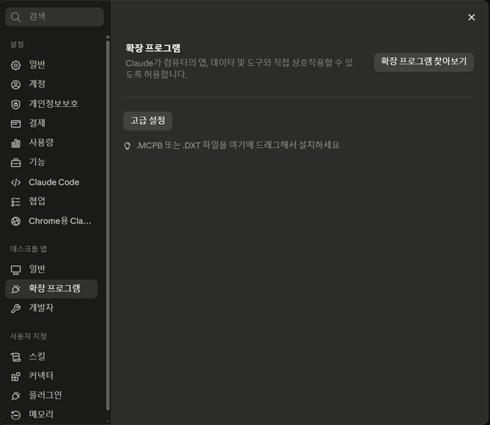
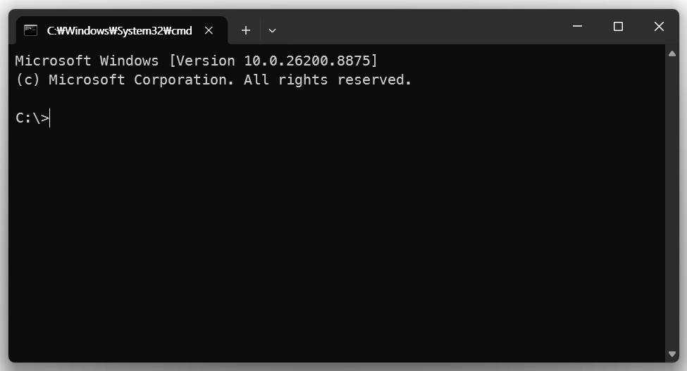
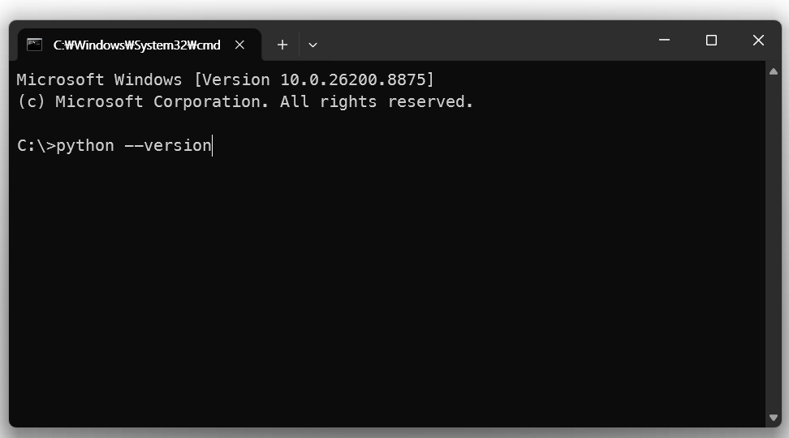
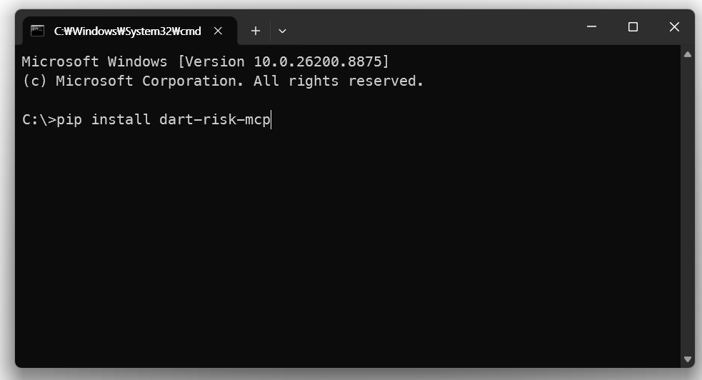
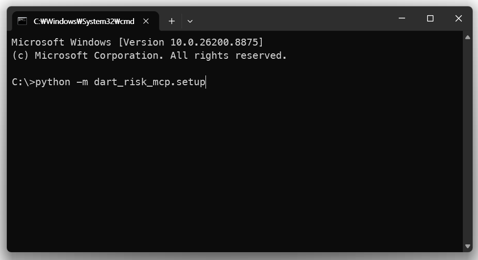
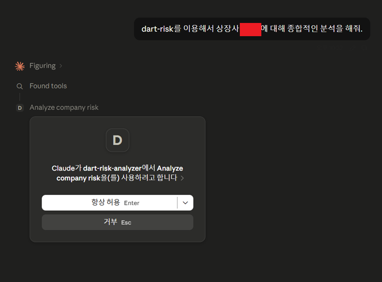

# DART 리스크 분석 MCP

[](https://pypi.org/project/dart-risk-mcp/) [](https://pypi.org/project/dart-risk-mcp/) [](https://pypi.org/project/dart-risk-mcp/) [](https://github.com/anboyu-alt/dart-risk-mcp/releases) [](https://pepy.tech/project/dart-risk-mcp) [](https://github.com/anboyu-alt/dart-risk-mcp/commits/master)

**공시 기반 불공정거래 위험 모니터링** — 금융감독원 전자공시(DART)에서 위험 신호를 읽어내는 MCP 서버입니다.

> 📖 **처음이신가요?** 사전 지식 없이 읽을 수 있는 [프로젝트 소개 페이지](https://anboyu-alt.github.io/dart-risk-mcp/)를 먼저 보세요.
>
> 🔎 **설치 없이 맛보기** — [리스크 뷰어](https://dart-risk-mcp.vercel.app): 종목명을 입력하면 본인의 무료 DART 키로 최근 12개월 공시를 실시간 스캔해 신호 타임라인·자본 이벤트 리듬을 시각화합니다(점수 없음, 사실만).

공시는 누구에게나 공개돼 있지만, **한 건씩 따로** 공개됩니다. 불공정거래의 신호는 낱장이 아니라 흐름과 연결에 있습니다 — 12개월 안에 자본을 세 번 주무르는 리듬, 회사마다 이름을 바꾸는 투자조합 뒤의 같은 임원, 조달 명분과 다른 곳으로 흘러간 돈. 이 도구는 Claude 같은 AI가 DART에 직접 접속해 그 흐름을 읽게 해 줍니다.

> **MCP란?** AI 클라이언트에 외부 도구를 연결하는 표준(Model Context Protocol)입니다. 설치하면 Claude Desktop, Claude Code, Cursor 등에서 한국어 질문만으로 공시 분석이 됩니다.
>
> 예: **"이 다섯 회사에 공통으로 등장하는 인물 있어?"** → 5개사의 CB 인수자·등기임원을 다년으로 겹쳐 공통 행위자를 찾아 줍니다.

---

## 설치하기

설치 방법은 두 가지입니다. **Claude Desktop을 쓴다면 방법 A(원클릭)** 가 가장 쉽습니다 — 터미널이 전혀 필요 없어요.

### 방법 A — 원클릭 확장(.mcpb) · Claude Desktop · 터미널 0 ⭐

1. **[최신 릴리스](https://github.com/anboyu-alt/dart-risk-mcp/releases/latest)에서 `dart-risk-mcp.mcpb` 파일을 내려받습니다.**
2. Claude Desktop → **설정(Settings) → Extensions** 를 열고, 받은 `.mcpb` 파일을 창에 **끌어다 놓습니다**(또는 "확장 설치"로 열기).
3. 설치 화면의 **DART API 키** 칸에 키를 붙여넣으면 **끝**입니다. (키가 없으면 아래 방법 B의 3단계에서 무료로 2분이면 발급 — 발급만 하고 이 칸에 붙여넣으면 됩니다.)

> 파이썬을 직접 설치할 필요 없이 Claude Desktop이 알아서 처리합니다.



*Claude Desktop → 설정 → 확장 프로그램. 이 화면에 `.mcpb` 파일을 끌어다 놓으면 설치됩니다.*

### 방법 B — 터미널로 설치 (Cursor·Windsurf·Claude Code 등 그 외 클라이언트)

처음이라도 순서대로만 따라오면 약 10분이면 끝납니다.

> ### ⛔ 가장 먼저 알아둘 것
>
> 아래에 나오는 `pip install ...` 같은 명령어는 **Claude(또는 ChatGPT) 채팅창에 입력하는 게 아닙니다.**
> 컴퓨터의 **"터미널"(명령 프롬프트)** 이라는 검은 창에 입력하는 것입니다.
> 채팅창에 붙여넣으면 아무 일도 일어나지 않아요. 터미널 여는 법은 바로 아래 **1단계**에 있습니다.

---

### 1단계 — 터미널(명령어 입력하는 창) 열기

명령어를 입력하는 전용 프로그램입니다. 운영체제에 따라 여는 법이 다릅니다.

- **Windows** — 키보드에서 `⊞ Windows` 키를 누르고 `powershell` 또는 `cmd` 라고 입력한 뒤 Enter. 파란색(또는 검은색) 창이 뜹니다.
- **Mac** — `⌘ Command + Space` 를 눌러 Spotlight를 열고 `터미널` 또는 `terminal` 이라고 입력한 뒤 Enter. 흰색/검은색 창이 뜹니다.

이 창이 앞으로 명령어를 입력할 곳입니다. **채팅창이 아니라 이 창입니다.**



*이렇게 검은 창이 뜨면 준비 완료. (Windows 예시 — `cmd`든 `powershell`이든 괜찮습니다.)*

---

### 2단계 — 파이썬(Python)이 설치돼 있는지 확인

이 도구는 파이썬이라는 프로그램 위에서 돌아갑니다. 대부분의 컴퓨터엔 없거나 버전이 낮으니 먼저 확인합니다.

터미널에 아래를 **그대로 입력하고 Enter**:

```bash
python --version
```



- `Python 3.11.x` 처럼 **3.11 이상** 숫자가 나오면 → 통과. **3단계로 가세요.**
- `Python 2.x` 가 나오거나, `'python'은(는) 내부 또는 외부 명령... 이 아닙니다` / `command not found` 같은 오류가 나오면 → 아직 없는 것입니다. 아래에서 설치하세요.

<details>
<summary>👉 파이썬 설치하는 법 (위에서 오류가 났다면 펼치세요)</summary>

1. [python.org/downloads](https://www.python.org/downloads/) 에 접속해 **노란색 다운로드 버튼**(최신 버전)을 눌러 설치 파일을 받습니다.
2. 설치 파일을 실행합니다.
   - **⚠️ Windows에서 아주 중요:** 설치 첫 화면 맨 아래의 **`Add python.exe to PATH`** 체크박스에 **반드시 체크**한 뒤 `Install Now`를 누르세요. 이걸 놓치면 나중에 `python` 명령을 못 찾습니다.
   - Mac은 그냥 `계속` → `설치`를 누르면 됩니다.
3. 설치가 끝나면 **터미널 창을 완전히 닫았다가 다시 열고**(중요), 다시 `python --version` 을 입력해 3.11 이상이 나오는지 확인하세요.
   - Mac에서 `python` 이 안 되면 `python3 --version` 으로 시도해 보세요. 이 경우 앞으로 나오는 `python` 을 전부 `python3` 로 바꿔 입력하면 됩니다.

</details>

---

### 3단계 — DART API 키 발급 (무료·2분)

DART(금융감독원 전자공시)에서 데이터를 가져오려면 본인 전용 열쇠(키)가 필요합니다. 무료입니다.

1. [opendart.fss.or.kr](https://opendart.fss.or.kr) 접속 → **오픈API 신청 → 인증키 신청/관리**.
2. 이메일 주소를 넣고 인증하면 **길고 복잡한 문자열**(예: `a1b2c3d4e5...`) 하나를 즉시 받습니다. 이게 API 키입니다.
3. 이 키를 메모장 같은 곳에 잠깐 복사해 두세요. 잠시 뒤 붙여넣습니다. (일 20,000건까지 조회 가능)

---

### 4단계 — 도구 설치하기

이제 **1단계에서 연 터미널 창**으로 돌아와, 아래 두 줄을 **한 줄씩** 입력하고 각각 Enter를 누릅니다.

```bash
pip install dart-risk-mcp
```



```bash
python -m dart_risk_mcp.setup
```



- 첫 줄(`pip install ...`)은 도구를 내려받아 설치합니다. 글자가 주르륵 지나가다 멈추면 완료된 것입니다.
- 둘째 줄(`python -m dart_risk_mcp.setup`)은 컴퓨터에 깔린 AI 프로그램(Claude Desktop 등)을 **자동으로 찾아 연결**해 줍니다. 중간에 **"API 키를 입력하세요"** 라고 물으면, 3단계에서 복사해 둔 키를 붙여넣고 Enter를 누르세요.
  - 터미널에 키를 붙여넣는 법: **Windows**는 창 안에서 마우스 오른쪽 클릭, **Mac**은 `⌘ Command + V`.
  - 기존에 쓰던 다른 MCP 설정이 있어도 지우지 않고 그대로 둡니다.

<details>
<summary>❓ `pip` 명령에서 오류가 난다면</summary>

- `'pip'은(는) ... 명령이 아닙니다` / `command not found: pip` → `pip` 대신 `python -m pip install dart-risk-mcp` 로 입력해 보세요.
- Mac에서 `python` 이 안 됐다면 `pip` 도 `pip3` 로, `python -m ...` 은 `python3 -m ...` 로 바꿔 입력합니다.
- `Permission denied` 류 권한 오류 → 명령 끝에 ` --user` 를 붙여 `pip install dart-risk-mcp --user` 로 시도하세요.

</details>

---

### 5단계 — AI 프로그램 재시작하고 질문하기

1. Claude Desktop(또는 사용 중인 AI 프로그램)을 **완전히 종료했다가 다시 켭니다.** (연결을 새로 읽어들이기 위해 꼭 필요합니다.)
2. 이제 채팅창에 평소처럼 한국어로 질문하면 됩니다:

   > **"삼성전자 최근 1년 공시 흐름 요약해줘"**

도구 이름을 외울 필요가 전혀 없습니다. 질문만 하면 AI가 알아서 알맞은 도구를 골라 씁니다. 잘 안 된다면 아래 "자주 막히는 부분"을 보세요.



*질문하면 이렇게 도구 사용 권한을 묻는 창이 뜹니다. **"항상 허용"**을 누르면 다음부터 묻지 않습니다 — 이 화면이 보이면 설치 성공입니다.*

---

<details>
<summary>🛠 자주 막히는 부분 (안 될 때 펼치세요)</summary>

- **AI가 "그런 도구가 없다"고 해요** → AI 프로그램을 완전히 껐다 켰는지 확인(5단계). 백그라운드에 남아 있으면 재시작이 안 된 것일 수 있습니다.
- **"DART_API_KEY가 없다"는 오류** → 4단계의 `python -m dart_risk_mcp.setup` 을 다시 실행해 키를 넣거나, 아래 "수동 설정"의 JSON에 키를 직접 넣으세요.
- **Claude Code 사용자** → 자동 셋업 대신 터미널에서 `claude mcp add` 명령으로 등록하는 것이 확실합니다.
- **그래도 안 된다** → [GitHub 이슈](https://github.com/anboyu-alt/dart-risk-mcp/issues) 에 오류 메시지를 그대로 복사해 올려 주시면 도와드립니다.

</details>

<details>
<summary>⚙️ 수동 설정 (JSON 직접 편집) · uv 사용자 — 익숙한 분만</summary>

자동 셋업 대신 설정 파일을 직접 편집하려면, 아래 내용을 클라이언트 설정 파일에 추가하고 `발급받은_키` 자리에 3단계의 키를 넣습니다.

```json
{
  "mcpServers": {
    "dart-risk": {
      "command": "python",
      "args": ["-m", "dart_risk_mcp"],
      "env": { "DART_API_KEY": "발급받은_키" }
    }
  }
}
```

- 설정 파일 위치: Claude Desktop은 `claude_desktop_config.json`, Claude Code는 `claude mcp add`, 기타 클라이언트는 각 문서 참조.
- uv 사용자: `"command": "uvx", "args": ["dart-risk-mcp"]` 로 대체 가능(별도 설치 불필요).
- 특정 버전 고정: `pip install dart-risk-mcp==1.6.0` · 개발판: `pip install git+https://github.com/anboyu-alt/dart-risk-mcp.git`

</details>

> 💡 **설치가 부담스럽다면** — 아무것도 깔지 않고 웹에서 바로 맛보는 [리스크 뷰어](https://dart-risk-mcp.vercel.app)가 있습니다. 종목명만 넣으면 최근 12개월 공시를 시각화해 줍니다.

---

## 무엇을 하나

| 축 | 내용 |
|---|---|
| **신호 탐지** | 위험 상관이 높은 공시 유형 **37종**(CB/BW, 무상감자, 최대주주 변경, 감사의견 이슈, 조회공시, 회생절차 …)을 8개 카테고리로 자동 표시. 금감원·금융위 공개 적발 사례 기반 키워드 |
| **패턴 인식** | 신호의 **조합 9종** — 무자본 M&A(`zombie_ma`), 상장폐지 회피, 허위 신사업 주가부양, 자본 이벤트 과다 반복(`capital_churn_anomaly`) 등 실제 적발 사례에서 추출한 시퀀스와 대조 |
| **행위자 추적** | 여러 회사의 CB 인수자·유상증자 참여자·**등기임원 명단을 다년으로 겹쳐** 공통 인물 탐지. 조합명은 매번 바뀌어도 임원 이름은 공시에 남는 고정점 |
| **재무 이상 스캔** | 매출채권·재고 급증, 이익·현금흐름 괴리, 전기 수치 재작성, 연결·별도 순이익 역전, XBRL에서 추출한 감가상각비로 복원한 **Beneish 연구 변수 8종**(지수 사실 표기, 합산 점수 없음) |

## 실제 대화는 이렇게 흘러갑니다

결과물은 표가 아니라 **대화 속 서술형 리포트**로 나오고, 후속 질문으로 꼬리를 물며 깊어집니다. 아래 AI 응답은 이 문서를 쓰면서 **실제로 MCP를 호출해 받은 응답(2026-07-18)**에서 그대로 발췌한 것입니다(인물명만 마스킹).

> 👤 **"제이스코홀딩스, 요즘 공시에 이상한 흐름 있어?"**
>
> 🤖 *track_capital_structure* —
> "🎯 **12개월 안에 자본 관련 공시가 지나치게 자주 반복되고 있습니다** — 증자·감자·자사주·CB/BW/EB/RCPS 같은 자본 구조 변경이 12개월 안에 3건 이상 몰리는 상태입니다. 정상적인 기업은 자본 구조를 자주 건드리지 않습니다. (…) 자본 이벤트 총 **47건** · 12개월 최대 집중도: **26건**"
>
> 👤 **"이름 바꿔가면서 여러 회사를 드나드는 세력은 어떻게 잡아? 이 다섯 회사에 공통 인물 있는지 봐줘"**
>
> 🤖 *find_actor_overlap (5개사 · 3년)* —
> "이번 비교에서 2곳 이상에 동시에 등장한 인수자가 **3명/건** 발견됐습니다.
> ⚠️ **신○수** — 3개 회사에 [임원] 경로로 등장 · ⚠️ **신○규** — 2개 회사 · ⚠️ **이○영** — 2개 회사 (…)"
>
> 👤 **"저 사람 워치리스트에 올려두고, 다음에 회사 늘려서 다시 봐줘"**
>
> 🤖 *manage_watchlist* — "✅ '신○수' 갱신 — 총 3개사: CG인바이츠, 제이케이시냅스, 헬스커넥트" — 다음부터 `find_actor_overlap(watchlist="…")` 한 줄로 회사군 전체 재조회.

더 긴 대화 데모는 [소개 페이지](https://anboyu-alt.github.io/dart-risk-mcp/#demo)에 있습니다.

## 도구 26개 — 질문으로 찾기

도구 이름을 외울 필요 없습니다. AI에게 질문하면 알맞은 도구가 호출됩니다.

| 이런 질문을 하면 | 이 도구가 움직입니다 |
|---|---|
| "이 회사, 괜찮은 거야?" | `analyze_company_risk` 종합 리포트 · `build_event_timeline` 시간순 서사 · `check_disclosure_anomaly` 공시 구조 지표 5종 · `get_company_info` |
| "공시 원문을 직접 읽고 싶어" | `list_disclosures_by_stock` 목록 · `get_disclosure_document` 원문 전체 · `list_disclosure_sections` 목차+주석 라벨 · `view_disclosure` 섹션/페이지 읽기 · `check_disclosure_risk` 한 건 분석 |
| "재무제표가 수상해" | `scan_financial_anomaly` 이상 스캔+Beneish 8종 · `get_financial_summary` · `compare_financials` 다사 비교 · `get_audit_opinion_history` 감사 5년 이력 · `track_debt_balance` 채무 잔액·차환 압박 |
| "돈이 어디로 갔는지 쫓고 싶어" | `track_fund_usage` 계획 vs 실제 집행 · `track_capital_structure` 자본 이벤트 리듬 · `get_major_decision` 합병·양수도 상대방 · `get_affiliate_investments` 출자망 |
| "사람을 쫓고 싶어" | `find_actor_overlap` 공통 행위자 탐지(간판 도구) · `track_insider_trading` 지분 변동 시계열 · `get_shareholder_info` · `get_executive_compensation` · `manage_watchlist` 인물 워치리스트 · `lookup_known_actor` 공개기록 조회(opt-in) |
| "시장 전체를 훑고 싶어" | `search_market_disclosures` 12개 프리셋 배치 스캔 · `find_risk_precedents` 신호 해설·위기 타임라인 |

## 실측으로 검증합니다

아래는 실제 DART API 응답에서 나온 결과입니다(해당 시점 기준, 사실 표기).

- **임원 겸직으로 세력 추적** — 무관해 보이는 5개 상장사를 3년 조회 → 같은 인물이 3개사 등기임원으로 겹치고 동행 인물 2명이 함께 드러남 (`find_actor_overlap`)
- **자본 주무르기 리듬** — 한 코스닥사에서 12개월 내 자본 이벤트 집중 + 공시의무 위반 동반 → `capital_churn_anomaly` 패턴 라이브 발화
- **연결<별도 역전** — 연결 순이익 4,189억 < 별도 1조 48억(−58.3%) 자동 표시 → 종속회사 합산 손실 확인 지점 (`CFS_OFS_REVERSAL`)
- **XBRL 좁은 추출** — 요약 재무 API에 없는 감가상각비를 사업보고서 XBRL에서 추출(연결 43.6조/39.6조) → Beneish DEPI·TATA 복원

**검증 방식**: 유가증권·코스닥 6개사 × 23개 도구의 실측 골드 출력 133건 + 테스트 459개가 저장소에 있으며, 모든 변경은 이 실측 출력과 대조해 회귀 검증됩니다. 라이브로 재현된 적 없는 신호는 [CLAUDE.md](CLAUDE.md)의 검증 매트릭스에 ⚠로 정직하게 표기합니다.

---

## 출력 원칙 — 점수를 매기지 않습니다

이 도구의 가장 중요한 설계 결정은 **"무엇을 하지 않는가"**입니다.

- **점수·등급 없음** — "위험도 82점", "고위험" 같은 표기를 일절 하지 않습니다. 정량화된 낙인은 그 자체로 판정이 되고 투자 권유로 오독됩니다. 이 원칙은 자동 회귀 테스트(`tests/test_golden_output_hygiene.py`)가 기계적으로 지킵니다.
- **사실 표기, 판정 없음** — "연결 순이익이 별도보다 58% 작습니다"까지만 말하고 "분식 의심"이라고 말하지 않습니다. 모든 출력에 근거 공시 접수번호가 붙습니다.
- **인물 낙인 없음** — 행위자 조회는 공개기록 등장 사실만 반환하며, 항상 동명이인 가능성과 원본 확인 필요를 고지합니다.
- **하나의 한국어 서술 출력** — level/mode/format 분기가 없습니다. 원시 데이터가 필요하면 원문 도구(`get_disclosure_document` 등)를 조합하세요.

### 이 도구가 하지 않는 것

| 안 하는 것 | 이유 |
|---|---|
| 매수·매도 추천, 가격 예측 | 출력은 투자 판단의 근거가 아닙니다 |
| 위험 점수·등급 부여 | 정량화는 판정·투자 권유로 해석될 수 있음 |
| 실시간 알림·자동 감시 | 조회는 항상 사용자가 시작합니다 |
| 업종 평균 비교 | DART 미제공 — 회사 자체의 전년 대비 추세만 사용 |
| 인물 데이터 배포 | 레지스트리 데이터는 저장소·배포물에 미포함(아래 opt-in 참조) |

---

## 행위자 레지스트리(opt-in)와 연결망

- **공개기록 행위자 레지스트리** — `lookup_known_actor` 등이 참조하는 인물 데이터는 v1.5.0부터 이 저장소·배포물에 포함되지 않습니다(빈 스켈레톤만 동봉). 원본은 제작자가 비공개로 관리하며, 조회 참여를 원하면 제작자에게 연락해 읽기 전용 접근을 요청하세요(opt-in). 명단 관련 이의·문의도 같은 경로로 받습니다.
- **행위자 연결망 시각화** — 반복 등장 행위자와 회사의 연결망을 보여주는 인터랙티브 화면을 별도로 운영 중입니다. 실명이 포함되는 특성상 **승인된 로그인 사용자만** 접근할 수 있고 링크는 공개하지 않습니다.
- 위 두 가지 모두 **문의는 [제작자 GitHub 프로필](https://github.com/anboyu-alt)의 연락처로** 보내 주세요.

---

## 개발자 안내

```bash
git clone https://github.com/anboyu-alt/dart-risk-mcp.git && cd dart-risk-mcp
pip install -e . && pip install pytest
python -m pytest -q                      # 전체 테스트 (API 키 불필요)
python scripts/regen_goldens.py --dry-run  # 실측 골드 재생성 매트릭스 확인 (키 필요)
```

- 아키텍처·26개 도구 상세·DART 엔드포인트 맵·신호 추가 방법: **[CLAUDE.md](CLAUDE.md)** (개발자 가이드)
- 변경 이력: [Releases](https://github.com/anboyu-alt/dart-risk-mcp/releases)
- 외부 의존성은 `mcp`, `requests` 둘뿐입니다(최소 의존성 원칙). HTML 파싱도 표준 라이브러리로 처리합니다.
- PR 환영합니다. 단, [비범위 항목](CLAUDE.md#비범위-v10-ga에서-영구-확정)(점수 부여·실시간 알림·매매 추천 등)은 설계 결정과 충돌하므로 받지 않습니다.

## 라이선스 · 크레딧

- **MIT License** — 자유롭게 사용·수정·배포할 수 있습니다.
- 일부 재무 분석 로직(업종별 회계정책 맵, 주석 분류, Beneish 변수, 감사인 별칭 등)은 [capitalparser/kreports-dart-mcp](https://github.com/capitalparser/kreports-dart-mcp)(Apache 2.0)에서 이식했습니다 — 상세 내역은 [THIRD_PARTY_NOTICES.md](THIRD_PARTY_NOTICES.md).
- 데이터 출처: 금융감독원 [DART OpenAPI](https://opendart.fss.or.kr).

> ⚠️ **면책**: 본 도구의 모든 출력은 공시라는 공개 기록의 사실 표기이며, 특정 기업·인물에 대한 판정이나 투자 권유가 아닙니다. 중요한 판단 전에는 반드시 DART 원문 공시를 직접 확인하세요.
